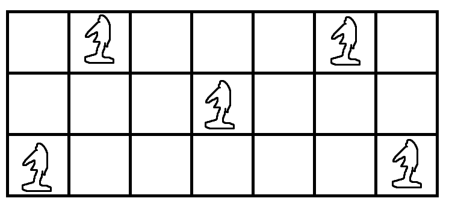
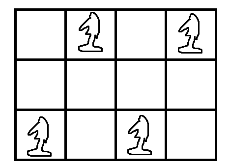

# BOJ1783 - 병든나이트

https://www.acmicpc.net/problem/1783

---

차근차근 생각해보자

-  N == 1
  - 나이트는 움직일 수 없다. 정답은 1
- N == 2
  - 나이트는 위1오2, 아래1오2 이 두가지 방법만 사용해야하고
  - 정답은 1 + (M-1)//2 가 된다(하지만 최대4)
- N == 3
  - 나이트는 이제 4가지 방법으로 움직일 수 있다
  - 이 때 최대한 compact하게 움직이려면 아래와 같이 움직여야한다



​	물론 순서는 다를 수 있겠지만, 4가지 방법을 모두 사용하려면 위와 같이 3 M이 7 이상이어야 한다.

만약 M이 7보다 작다면, 최대 3번까지만 움직일 수 있고 이때 가장 많이 움직일 수 있는 경우는 아래와 같다



- - 즉 M이 4이상 7미만일땐 정답은 4이다
  - M이 작아지면 총 1 + (M-1) 이 정답이 된다

---

N이 3보다 큰 경우는 크게 의미가 없다. 어차피 최대한 많이 이동할때 높이3인 체스판내에서만 움직여도 크게 상관이 없기 때문이다.

- 이제 M이 7이상인 경우만 생각하면, 위에서 구한 7칸에 5번 후에는 위2 or 아래2로 M이 커지는만큼 움직일 수 있다. 즉 5 + (M-7) 만큼의 칸을 차지하게 된다

```python
N, M = map(int, input().split())

if N == 1:
    print(1)
elif N == 2:
    print(min(1 + (M-1)//2, 3))
else:
    if M < 4:
        print(M)
    elif M < 7:
        print(4)
    else:
        print(M-2)
```