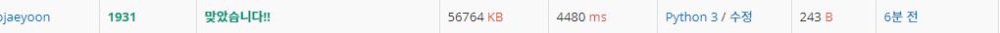
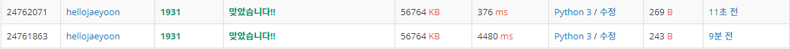

# BOJ1931 - 회의실배정

https://www.acmicpc.net/problem/1931

---

- 매우 간단하게 생각을 해서 시작시간이 같은 두 회의가 있다고 하자.
  - 그럼 더 많은 회의를 진행하기 위해선 이 두 회의중 더 일찍 끝나는 회의를 고르는 것이 무조건적으로 좋다.

- 첫 번째 회의를 선택하는데 있어서 [a,b]의 회의를 선택하게 되면, 사실상 [0,b]만큼의 회의실 시간을 사용하게 되는것과 같다.
  - 즉 첫 번째 회의는 모든 회의들 중 가장 이른시각에 끝나는 회의를 고르는것이 무조건적으로 좋다고 할 수 있다.
- 그럼 이제 첫 번째 회의가 끝나는 시각을 기준으로, 두번째 회의는 가능한 남은 회의들중에서 마찬가지로 가장 일찍 끝나는 회의를 고르는것이 좋다고 할 수 있다. 이렇게 계속 고르다보면 우리가 원하는 회의의 최대 개수를 구할 수 있다.

---

```python
N = int(input())
meetings = [list(map(int, input().split())) for _ in range(N)]
meetings.sort(key=lambda x: (x[1], x[0]))
ans = 0
endtime = 0
for meet in meetings:
    if endtime <= meet[0]:
        ans += 1
        endtime = meet[1]
print(ans)
```

---

- 일단 처음엔 97%에서 틀렸다

  - 그 이유는 [4,4] [1,4] 와 같이 meetings가 있을때, [1,4] [4,4] 를 둘 다 이어서 할 수 있어야하는데, [4,4] 를 먼저 고르면 [1,4] 는 불가능해지기 때문이다

- 위 코드에서 아래코드로 살짝 수정해주었다. 

  ```python
  meetings.sort(key=lambda x: x[1])
  meetings.sort(key=lambda x: (x[1], x[0]))
  ```

---

일단 아래와 같이 나의 코드는 엄청난 시간을 소요했다



그래서 혹시 몰라 sys.stdin.readline으로 다시 짜보았다.



```python
import sys

N = int(input())
meetings = [list(map(int, sys.stdin.readline().split())) for _ in range(N)]
meetings.sort(key=lambda x: (x[1], x[0]))
ans = 0
endtime = 0
for meet in meetings:
    if endtime <= meet[0]:
        ans += 1
        endtime = meet[1]
print(ans)
```

- 정말 단순히 input을 sys.stdin.readline으로 바꾸었을 뿐이지만 압도적으로 빠르게 끝났다.

