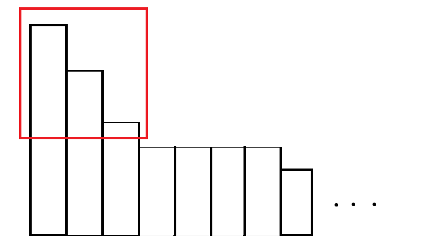
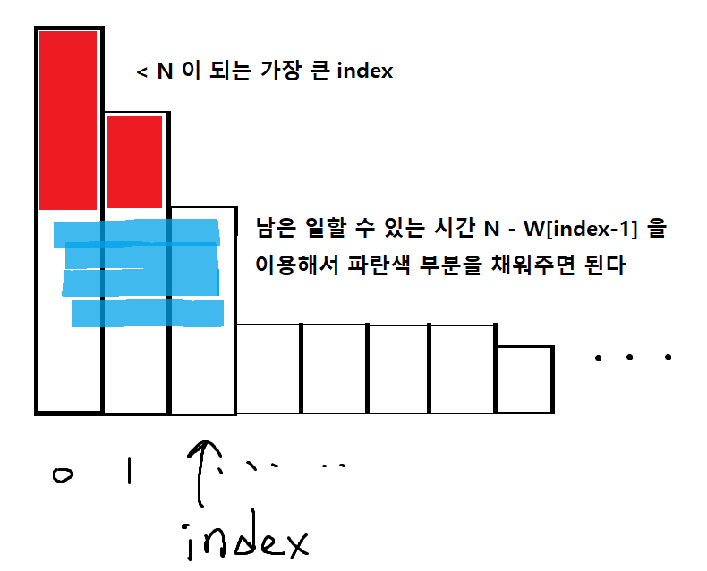

# 배상 비용 최소화

---

## Solution

- 일을 한 번 할때마다 남은일들중 가장 많이남은일을 하나씩 해결하면 마지막에 `남은 일의 작업량을 제곱하여 모두 더한 값` 이 최솟값이 된다

  - 처음에 주어진 작업량이 x_1, x_2, ... ,x_k (오름차순)라고하면

  - N = 0 일때, (x_1)^2 + ... + (x_k)^2 가 최솟값이다

  - N = 1 일때, 어떤 x_a 으로부터 1을 뺐을때 (x_1)^2 + ... + (x_k)^2 의 값은

    2*(x_a) - 1 만큼 작아진다. 즉 가장 많이 작아지려면 가장 큰 값인 x_k에서 1을 빼주어야한다

  - 귀납적으로 매번 최선의 선택을 하는건 남은 일들중 가장 많이 남은일을 하나씩 하는것이다

- 자 그럼 위의 방법대로 일을 처리한다고 하자

- 가시적으로 알아보기 쉽게 그림을 그려보면 아래와 같다



- 왼쪽부터 직사각형들이 각 일에 필요한 작업량을 높이로 표현했다고 하자. 내림차순정렬을 하면 위와 같은 모양이 되는데, 이때 우리는 가장 높은부분을 위에서부터 잘라내어야한다.

- 잘라낸양이 N이 넘지 않을때까지 작업을 1씩 잘라내어야한다.
- 그럼 우리가 필요한 정보는 `어디까지 얼만큼 잘라내었냐?` 이다
- 그 정보를 얻기 위해 잘라내는걸 멈춘 시점 index와 잘라낸 양 W 를 아래와 같이 만들어 주었다

```python
Diff = [0 for _ in range(L)] (연속한 두 작업양의 차이)
W = [0 for _ in range(L)] (높이 works[i] 까지 잘라낼때 필요한 작업량)

index = -1
if W[0] >= no:
    index = 0
    else:
        for i in range(1, L):
            W[i] = W[i - 1] + (i + 1) * Diff[i]
            if W[i] >= no:
                index = i
                break
```

---



- 그건 따로 특별히 계산해주지 않고 최종 result 값에 고려해서 한 번에 더해주었다

```python
mok, r = divmod(no - W[index - 1], index + 1)

for i in range(index + 1):
    if i < r:
        result += (works[index] - mok - 1) ** 2
        else:
            result += (works[index] - mok) ** 2
```

---

최종코드는 아래와 같다

```python
def solution(no, works):
    result = 0
    works.sort(reverse=True)
    L = len(works)
    if no >= sum(works):
        result = 0
    elif L == 1:
        result = (works[0]-no) ** 2
    else:
        Diff = [0 for _ in range(L)]
        W = [0 for _ in range(L)]

        for i in range(L - 1):
            Diff[i] = works[i] - works[i + 1]
        Diff[L - 1] = works[L - 1]
        W[0] = Diff[0]
        index = -1
        if W[0] >= no:
            index = 0
        else:
            for i in range(1, L):
                W[i] = W[i - 1] + (i + 1) * Diff[i]
                if W[i] >= no:
                    index = i
                    break
        mok, r = divmod(no - W[index - 1], index + 1)

        for i in range(index + 1):
            if i < r:
                result += (works[index] - mok - 1) ** 2
            else:
                result += (works[index] - mok) ** 2

        for i in range(index + 1, L):
            result += works[i] ** 2

    return result
```

